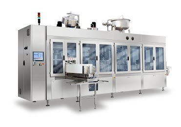
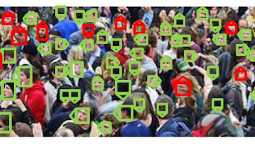
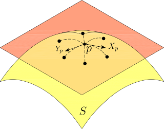
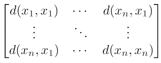

# Diego builds

[Diego Tosato](https://www.linkedin.com/in/dtosato/) graduated at the University of Verona, Italy, in Information Technology (Bachelor's Degree) in 2006 and in Intelligent and Multimedia Systems (Specialist Degree) in 2008. He earned his PhD in 2012 at the Department of Computer Science, University of Verona, working with the [VIPS (Vision, Image Processing and Sounds) Lab](vips.sci.univr.it). He worked seven years as R&D engineer/scientist dealing with artificial intelligence and big data topics. Now he works as senior software engineer and data scientist at [Galdi S.r.l.](www.galdi.it) on IIoT (Industrial Internet of Things) systems.

## Posts

### Deep Learning-based Production Forecasting in Manufacturing: a Packaging Equipment Case Study

In [this work](https://drive.google.com/file/d/1786cyeb1RUIUz2zJDLNUeIB9bYTh92ne/view?usp=sharing), we propose a Deep Learning-based approach for production performance forecasting in fresh products packaging. On the one hand, this is a very demanding scenario where high throughput is mandatory; on the other, due to strict hygiene requirements, unexpected downtime caused by packaging machines can lead to huge product waste. Thus, our aim is predicting future values of key performance indexes such as Machine Mechanical Efficiency (MME) and Overall Equipment Effectiveness (OEE).We address this problem by leveraging Deep Learning-based approaches to exploit the full informative content of available historical data. In the proposed approach, we consider historical production performance data and measurements about warnings and alarms occurred during production stage, and combine them as a composite input to the neural network. The network the predicts future values for OEE and MME. Different architectures and prediction horizons are analyzed and compared to identify the most robust and effective solutions. We provide experimental results on a real industrial case, showing advantages with regard to current policies implemented by the industrial partner both in terms of forecasting accuracy and maintenance costs.

### Realtime Analytics with SAP HANA Platform

We have built a POC combining [OpenPose](https://github.com/CMU-Perceptual-Computing-Lab/openpose) and streaming analytics exploiting SAP HANA platform.

### SeNSE (Skyline eNterprise Search Engine)

Enterprise resource planning (ERP) systems are the core of many companies: they contain entities which are the focus of enterprise searches.  SeNSE (Skyline ENterprise Search Engine) implements a model which exploits those entities to improve the search experience of enterprise users is proposed. Specifically, a graph knowledge base called entity graph is defined. It is used both to offer a novel data exploration experience that reflects the business processes and to improve the search accuracy contributing to the score of a search result into a weighted linear model (see [Tosato IIR 2016](https://drive.google.com/file/d/0B0MZ5gr7K36SclBNUDhmei1aY0k/view?usp=sharing)).

### ArCO and WArCO ( Weighted ARray of COvariances)

ArCO and WArCO are  multi-class object detector based on a patch based model able to deal with low resolution objects as described in [Tosato et al. [ECCV2010](https://drive.google.com/open?id=0B0MZ5gr7K36ScHV1OXR3UnNlb3M) , Tosato et al. [PAMI2012](https://drive.google.com/open?id=0B0MZ5gr7K36SeFBqRkNHLWlYOE0)].

Code:

* [ArCO](https://github.com/dtosato/arco) (_deprecated_)
* [WArCO](https://github.com/dtosato/warco)

### Low Resolution Pedestrian Detection

Robust object detection is important for many applications. In particular, in the context of video surveillance, pedestrians are a very important, and very challenging, class of objects to detect.

### Human Characterization

In computer vision, and especially in videosurveillance, the capability of characterizing humans is surely of primary importance. In this regard, social signal processing studies support the hypothesis that the body appearance is critical for inferring many behavioral traits, yielding to fine activity profiles.

Data: [Group Detection (GDet) Head Pose Dataset](https://drive.google.com/open?id=0B0MZ5gr7K36SZ2wwYlVsQ0w4Yk0).

Benchmark: [GDet Head Pose Estimation Confusion Matrix](https://drive.google.com/open?id=0B0MZ5gr7K36ST0U2T0h4OFdrdkk) (updated 27/04/2011).

### Learning On Matrix Manifolds

Many problems in computer vision uses matrices (or tensors) to describe data. Matrix spaces have a so-called manifold structure. I am interested in building machine learning approaches for classification and regression problems on those spaces. I spent most of my efforts in working on SPD (Symmetric Positive Definite) matrices (see [Tosato et al. - 2010](https://drive.google.com/file/d/0B0MZ5gr7K36ScHV1OXR3UnNlb3M/view?usp=sharing)).

### Tensor Representation for Object Detection and Classificaton

Employing tensor representation, it is able to describe the interactions of multiple factors inherent to image formation and separately encode the higher-order statistics of each of these factors. One of the most convenient uses for tensors is to represent complex objects in order to build a discriminative representation (see [Tosato et al. 2011](https://drive.google.com/open?id=0B0MZ5gr7K36SemN2SGJLSlczTkE)).
